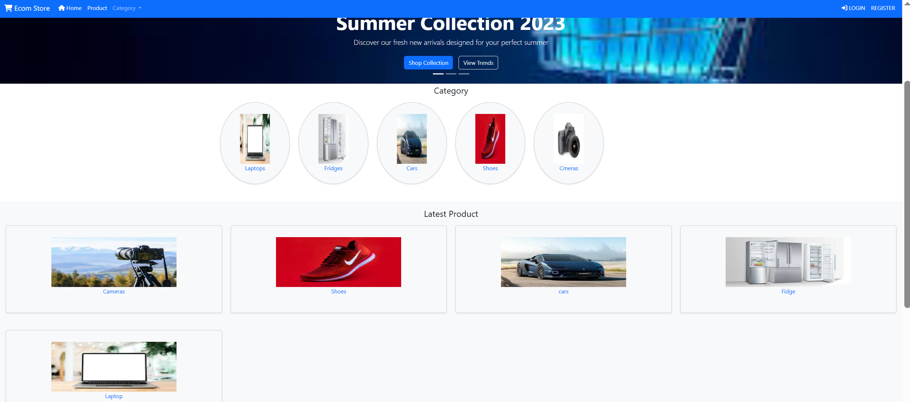
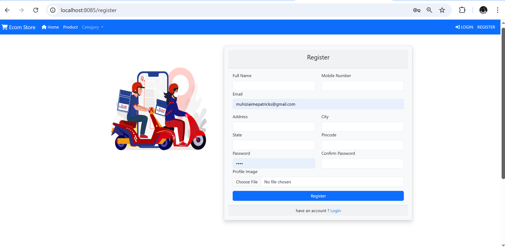
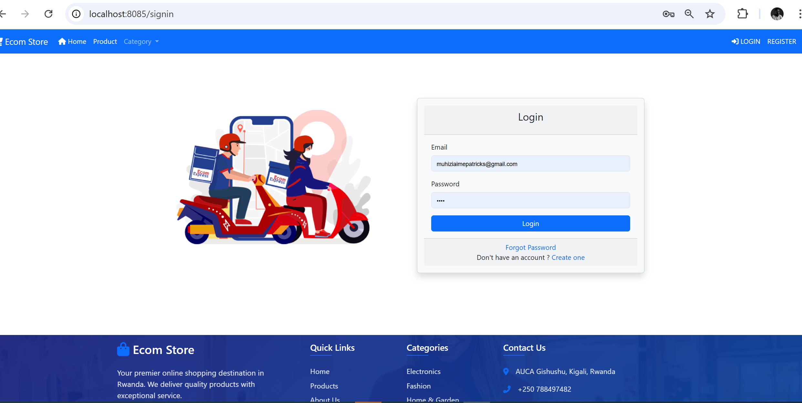
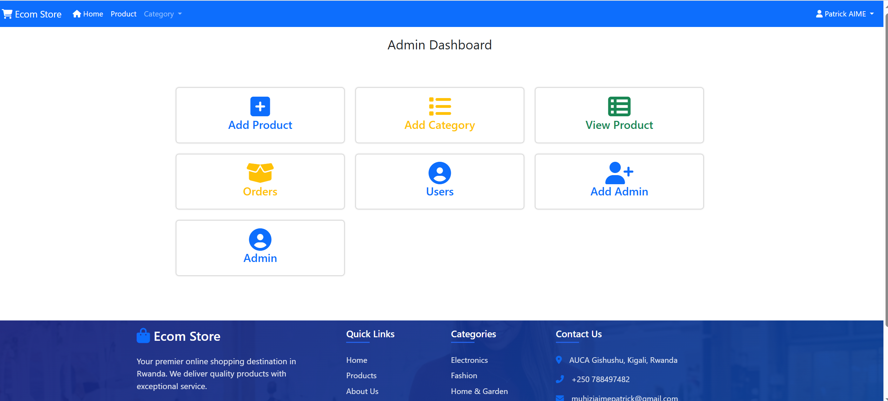
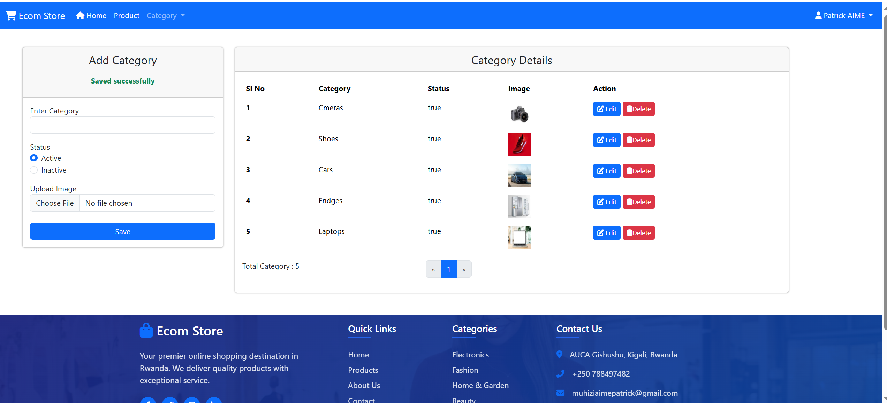
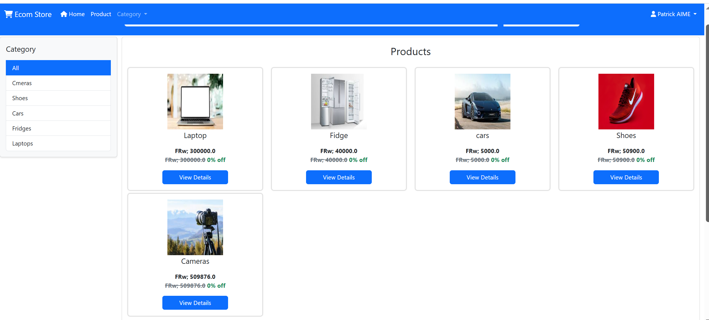
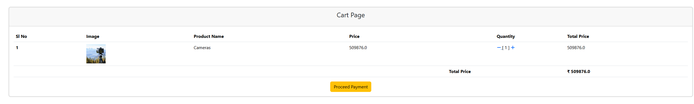

# PATRICK MUHIZI ID 21841
# My final exam ecommerce webtech application

#  E-Commerce Web Application

A full-stack e-commerce web application developed using **Spring Boot** and **Thymeleaf**. The app enables users to browse products, manage a shopping cart, place orders, and provides administrative tools for product and order management.

---
### Home Page


### 👤 Customer:
- Register and log in securely
- Browse available products
- View detailed product information
- Add/remove products to/from cart
- View cart and checkout
- View order history
- 
### Register Page


### Login Page


###  Admin Roles:
- Log in as admin
- Add, edit, or delete products
- View all orders
- Update order status

### Admin Dashboard:
  
### Adding Product category

### Product page


### product details page

### shopping cart page


### checkout page


## Technologies Used

- **Backend:** Spring Boot, Spring Data JPA, Spring Security
- **Frontend:** Thymeleaf, Spring MVC, Bootstrap
- **Database:** MySQL
- **Deployment:** Railway
1. **Clone the Repository**
   ```bash
   git clone https://github.com/MuhiziPa/Muhizi-Aime-Patrick-_21841_e-commerce-final